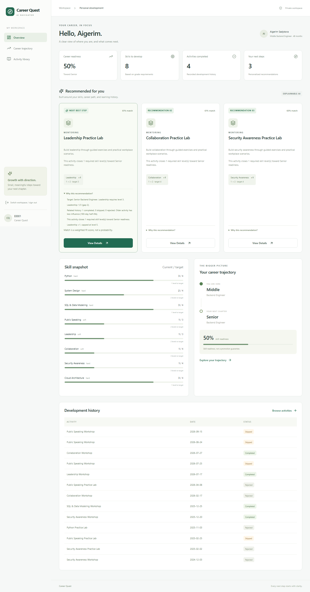
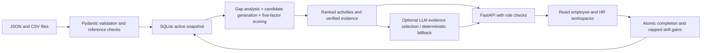

# Career Quest

**AI Navigator for Employee Development · Halyk Bank track · HackAlem**

[Русская инструкция](README_RU.md) · [Проверка по официальному ТЗ](docs/REVIEW.md)

Career Quest helps employees identify a useful next development activity and gives HR an aggregate view of skill gaps and participation. It uses real JSON/CSV ingestion, transparent multi-factor scoring, and persistent completion updates.

**The recommendation engine performs the decision-making and the LLM provides a human-readable explanation.** No API key is required. No recommendations are hardcoded.

## Quick start

Requirements: Python 3.11+ and Node.js 22.12+ (Python 3.14 and Node 22.16 were tested). From the repository root:

```sh
python run.py
```

The launcher creates `.venv`, installs locked Python and npm dependencies, builds the frontend, and serves everything at **http://127.0.0.1:8000**. First startup needs an internet connection to install dependencies. Ctrl+C stops the server. On this workspace a local Node distribution is available under the ignored `.tools` directory; the launcher detects it automatically.

No official hackathon dataset was present in the workspace or supplied attachments. `data/sample/` contains clearly labeled **synthetic** fixtures: 12 employees, 24 activities, 12 skills, and history spanning up to 24 months. All API responses are calculated from the active dataset; these are not mocked API responses. Import the official files through HR → Dataset manager when available. Any record count is supported; there is no fixed list of employee IDs.

## Problem and solution

The lowest skill is not always the right next development step. A useful recommendation must consider grade requirements, the activity's actual gains, prior participation, and the employee's career direction. Career Quest makes those tradeoffs visible and records the effect of completed learning activities.

Features:

- Employee profile, current skills, gaps, next grade and readiness.
- Up to three dynamically scored activities with five evidence statements each.
- Separate “Why this recommendation?” details and an available activity library.
- Atomic, persistent completion with per-activity caps and duplicate protection.
- HR skill-gap and participation charts, outcome rates, and searchable employee overview.
- Four-file dataset validation and atomic replacement; invalid imports leave current data intact.
- Server-side employee/HR access checks and an explicitly open jury demo mode.
- Optional OpenAI-compatible explanation adapter with timeout, grounding validation and fallback.
- Responsive React/TypeScript UI, Vite, Tailwind, Recharts, FastAPI, Pydantic and SQLite.

### Screenshots

Screenshots use only the self-authored synthetic sample.



[HR workspace screenshot](docs/screenshots/hr.png)

## Architecture



```text
backend/app/models.py                 Schema and cross-reference validation
backend/app/data.py                   Import and transactional SQLite storage
backend/app/auth.py                   Sessions and employee/HR permissions
backend/app/main.py                   API routes and production SPA hosting
backend/app/recommender/trajectory.py  Grade targets, gaps and readiness
backend/app/recommender/history.py     Recency-weighted participation signal
backend/app/recommender/engine.py      Candidate generation and scoring
backend/app/ai/explanation_service.py  Grounded explanation adapter and cache
backend/tests/                        Unit, integration and performance tests
frontend/src/                        React routes, typed API client and styling
frontend/tests/                      Playwright jury journey
data/sample/                         Synthetic, valid JSON/CSV fixtures
scripts/generate_sample.py            Reproducible sample generation
run.py                               One-command setup and launch
```

## Recommendation algorithm

1. Find the next defined grade in `GRADE_ORDER`, considering skills relevant to the employee's role. At the highest known grade, evaluate current-grade readiness. Unknown grades do not imply an invented next step.
2. Compute each gap as `max(0, required - current)`. A missing skill starts at level zero. Requirements are supplied by the dataset, never guessed from job titles.
3. Consider activities whose audience includes the employee's role or grade (or is unrestricted). Exclude completed activities and activities unable to close any relevant gap. Skips and rejections are **not** exclusions.
4. Compute achievable gain as `max(0, min(gain, max_level - current))` and useful gain as the portion that closes a gap.
5. Score every remaining activity using normalized factors:

| Factor | Default weight | Definition |
|---|---:|---|
| Skill gap | 0.30 | Mean `gap / required` for skills with useful gain |
| Grade importance | 0.25 | Covered skill importance / all missing-skill importance, multiplied by 2 and capped at 1 |
| Activity relevance | 0.20 | Useful gain / total advertised activity gain |
| History | 0.15 | Neutral 0.5, adjusted by recency-weighted related outcomes |
| Career trajectory | 0.10 | Mean fraction of each gap closed, weighted 1 for raised next-grade requirements or 0.6 for existing requirements |

History matches shared skill IDs, weighted by overlap. Outcomes have values completed `+1`, skipped `-0.8`, rejected `-0.6`; weights decay with a **180-day half-life**. The factor is `0.5 + 0.5 × sum(weight × outcome) / (1 + sum(weight))`. Old skips fade toward neutral instead of penalizing an employee indefinitely. Each employee's history is filtered once before candidate scoring.

Scores are weighted sums in `[0,1]`, sorted descending with activity ID as a deterministic tie-breaker. “Match” is a fit score, **not statistical confidence**. The engine returns scores, factors, weights, skill effects and five structured reasons. Modify `DEFAULT_WEIGHTS` or set `RECOMMENDATION_WEIGHTS` to a JSON object with the same five keys; nonnegative weights are normalized.

Readiness is `100 × sum(min(current, required)) / sum(required)` for the target grade. It is skill readiness, not a promise of promotion or a promotion date. With no defined requirements, readiness is unknown rather than fabricated.

## AI architecture and factual grounding

The engine alone chooses and ranks activities. The optional LLM receives only verified evidence statements, without employee names or IDs, and selects 3–5 evidence keys in a useful reading order. The service renders the corresponding natural-language statements. This constrained approach prevents invented levels, properties, dates, or employee facts from entering the explanation.

Invalid output, timeout, authentication failure, or a missing key returns a deterministic explanation containing skill gap, activity effect, and history. Calls for the three recommendations run concurrently with a six-second total budget per call. A bounded 512-entry content-addressed cache avoids repeated explanation calls. HR aggregation never calls the LLM. A configured external provider receives role/skill/history summaries, so only enable it under your organization's data policy.

## Dataset schema

Upload all four UTF-8 files together with their exact names. JSON accepts an array or a named wrapper such as `{"employees": [...]}`. Unknown metadata fields are retained, but required fields and cross-references are validated. Levels are integer 0–5; gain is integer 1–5. IDs use letters, digits, underscores, dots or hyphens. Duplicate employee/event/skill IDs and duplicate skills in an activity are rejected. Each file is limited to 10 MB.

`employees.json`:

```json
[{"employee_id":"E0028","name":"Optional name","role":"Backend Engineer","grade":"Middle","tenure_months":52,"skills":{"SK_SYSTEM_DESIGN":2}}]
```

`skills.json`:

```json
[{"skill_id":"SK_SYSTEM_DESIGN","name":"System Design","category":"hard","requirements":{"Junior":1,"Middle":2,"Senior":4},"roles":["Backend Engineer"],"importance":2}]
```

`roles` and `importance` are optional extensions. Missing/empty `roles` means the skill applies to all roles; default importance is 1. If official data supplies only global grade requirements, those requirements apply globally. Role-specific targets cannot be inferred reliably without that metadata.

`events.json`:

```json
[{"event_id":"EV012","name":"System Design Workshop","type":"training","audience":["Backend Engineer"],"description":"Practice architecture tradeoffs.","skills":[{"skill_id":"SK_SYSTEM_DESIGN","gain":1,"max_level":4}]}]
```

Audience can be a string or list. Empty audience, `all`, `all employees`, or `*` is unrestricted; other values match a role or grade case-insensitively. The audience list has OR semantics. `type` and `description` are optional. Skills must use the nested effect format shown above.

`activity_history.csv`:

```csv
employee_id,event_id,date,status
E0028,EV012,2026-01-10,skipped
```

Dates are ISO dates, cannot be in the future, and statuses are `completed`, `skipped`, or `rejected`. Empty history is valid with the required header. Employee skills are the **current snapshot**; imported historical gains are not replayed. A recorded completed event cannot be credited again. Repeated learning sessions should have distinct event IDs. Completion never lowers an already higher skill level.

This schema follows the provided specification examples. If the official files use a different structure or status vocabulary, add an explicit adapter in `parse_dataset` with tests; the app rejects unsupported shapes instead of silently misinterpreting them.

Full four-file uploads replace the active dataset and its mutable state in one transaction. Invalid datasets do not replace anything. Replacement clears explanation cache and invalidates employee sessions, retaining HR sessions. Source files remain unchanged; SQLite stores the active snapshot and completions. Back up `runtime/career_quest.sqlite` to preserve a session. On later launches the saved database takes precedence over `DATASET_DIR`.

### Additional jury profiles

In Dataset manager select **Add jury profiles ? 2 files** to import only `employees.json` and `activity_history.csv` against the existing catalog. IDs must be new and history must belong to the supplied profiles. The operation is atomic; existing employees, progress and sessions remain unchanged. Duplicate IDs are rejected rather than overwriting progress. `data/jury-example/` contains three self-authored adversarial examples using the sample catalog, not the official jury profiles.

The specification prohibits taking official starter-kit data outside the hackathon. Keep it local, outside `data/sample` and `data/jury-example`; other `data/` directories are ignored by Git.

## Environment

Copy `.env.example` to `.env` if configuration is needed. `.env` is ignored by version control. The backend and Vite read the repository-root file.

| Variable | Default / purpose |
|---|---|
| `OPENAI_API_KEY` | Empty; deterministic explanations |
| `LLM_MODEL` | `gpt-4o-mini`; model name accepted by your provider |
| `LLM_BASE_URL` | `https://api.openai.com/v1`; compatible API base |
| `DEMO_MODE` | `true`; open employee/HR selection for jury use |
| `HR_ACCESS_KEY` | Required for HR login when demo is false |
| `EMPLOYEE_CREDENTIALS_FILE` | Path to an untracked JSON map of employee IDs to random access keys |
| `DATASET_DIR` | `data/sample`; four source files for initial database creation |
| `STATE_DB` | `runtime/career_quest.sqlite` |
| `GRADE_ORDER` | `Junior,Middle,Senior,Lead`; configure for your grade taxonomy |
| `RECOMMENDATION_WEIGHTS` | JSON object overriding the five weights |
| `VITE_API_URL` | Empty means same origin; optionally `http://localhost:8000` |

Do not put API secrets in variables prefixed `VITE_`, since those are bundled into browser code. In the one-command setup, keep `VITE_API_URL` empty for a same-origin deployment. With Vite development, the built-in proxy also works without this variable.

## Separate development commands

Windows:

```powershell
python -m venv .venv
.\.venv\Scripts\python -m pip install -r backend/requirements.lock.txt
.\.venv\Scripts\python -m uvicorn app.main:app --app-dir backend --reload --port 8000
```

In a second terminal:

```sh
cd frontend
npm ci
npm run dev
```

Open http://localhost:5173. On macOS/Linux use `.venv/bin/python` for backend commands. Build with `npm run build` inside `frontend`. Restart the backend after the first build to enable static frontend hosting. API documentation is at `/docs`.

## API

Protected requests use `Authorization: Bearer <token>` from `POST /auth/login`.

| Method | Path | Access |
|---|---|---|
| GET | `/health` | Public status and demo flag |
| GET | `/demo/employees` | Public only when demo enabled |
| POST | `/auth/login` | `{role, employee_id?, access_key?}` |
| DELETE | `/auth/session` | Revoke current session |
| GET | `/employees` | HR: all; employee: own record |
| GET | `/employees/{id}` | Own profile or HR |
| GET | `/employees/{id}/skills` | Own profile or HR |
| GET | `/employees/{id}/trajectory` | Own profile or HR |
| GET | `/employees/{id}/recommendations` | Own profile or HR |
| GET | `/employees/{id}/history` | Own profile or HR |
| GET | `/employees/{id}/activities` | Own profile or HR |
| POST | `/employees/{id}/activities/{event_id}/complete` | Own profile or HR |
| GET | `/hr/dashboard` | HR |
| GET | `/dataset/status` | HR |
| POST | `/dataset/upload` | HR; multipart repeated field `files` |
| POST | `/dataset/profiles` | HR; employees and history for new IDs |

Frontend routes: `/`, `/login`, `/dashboard`, `/employee/:id`, `/employee/:id/trajectory`, `/employee/:id/activities`, `/employee/:id/activity/:activityId`, `/hr`, `/dataset`.

## Tests and verification

From the root:

```powershell
.\.venv\Scripts\python -m pytest -q
```

After building the frontend (the test runner starts an isolated server at port 8001):

```sh
cd frontend
npx playwright install chromium
npm run test:e2e
```

**Browser tests automatically use a disposable temporary database and do not modify the running workspace.** They exercise landing/login, actual four-file upload, page refresh, recommendations, evidence, completion, trajectory, activity library, mobile layout and HR. Screenshots are written to `frontend/test-results/`. Backend tests use isolated temporary databases and cover gap calculations, next grade, weighted scores, lowest-skill counterexample, history decay, caps, concurrent duplicate completion, persistence, invalid records, permissions, new dataset identities, LLM failures and ungrounded output, cache, and a 200-employee HR response-time target under two seconds.

## Exact jury demo

1. Run `python run.py`; open http://127.0.0.1:8000.
2. Select **Try Demo**, choose any loaded employee, then **Open workspace**. The selection is populated by the dataset.
3. Review role, grade, readiness, gaps, and the three recommended next steps. Open **Why this recommendation?** to see the five factors.
4. Choose **View Details** on the first recommendation; inspect current level, target and expected gain.
5. Click **Complete Activity**. The success message reports before/after levels. Return to overview to see updated readiness, history, and recommendations; the completed activity is no longer recommended.
6. Open **Career trajectory**, then **Activity library**.
7. Select **Switch workspace / sign out**, choose **HR workspace**, and open it. Inspect gap charts, participation, rates, and individual development profiles.
8. Open **Manage dataset**. Select the four official files (or all four `data/sample` files to reset the sample), then **Validate & load dataset**. Verify all four loaded counts. Switch to employee mode and select an employee from the imported dataset.

Recommendations depend on current data; no specific activity is promised as the demo winner. The dedicated difficult-profile test proves System Design can outrank lower Public Speaking after repeated related skips.

## Privacy, security and scope

Employee tokens can read/write only their own profile; HR tokens can inspect development information, manage imports, and record completions. There is no public leaderboard or performance ranking. HR “main gap” is the largest missing level for support purposes, not an employee ranking. Participation rates use all history records as denominator; active development means at least one completion in the last 90 days.

Demo mode deliberately permits selecting any loaded identity, including HR. **Disable `DEMO_MODE` before loading confidential data into an accessible deployment.** Non-demo mode requires provisioned access keys; employee keys are read from an external JSON file and never sent to the frontend. Sessions are random bearer tokens stored in browser session storage, expire after eight hours, and are revoked by logout. Server restart invalidates sessions. Credential files and `.env` must remain untracked. No secrets are included in this repository.

This is a single-process MVP, using an in-process lock around SQLite snapshot transactions. Run one backend worker. For production: add corporate SSO, managed session storage, rate limiting, TLS, audit logs, managed secrets and encrypted backups. The launcher binds to loopback. No paid API was needed for validation; live provider credentials were not supplied, so provider success was tested using controlled adapter responses and real failure fallback.

## Future improvements

Role-specific grade matrices from HR, longitudinal skill assessments, skill prerequisites, diversity-aware activity selection, mentor matching, localized interfaces, calendar integration and an authenticated activity authoring workflow. Validate weights with employee/HR feedback before treating scores as policy.

Implementation references: [Vite guide](https://vite.dev/guide/) and [FastAPI file uploads](https://fastapi.tiangolo.com/tutorial/request-files/).
